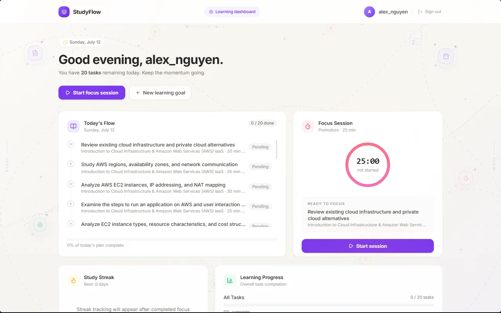
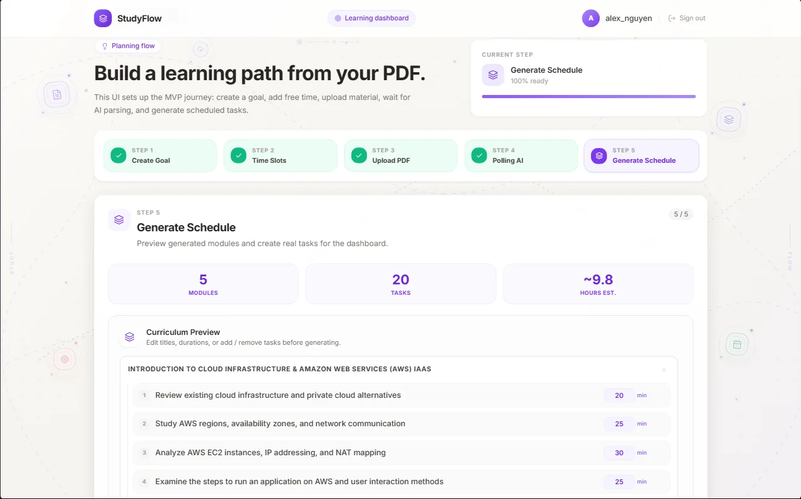
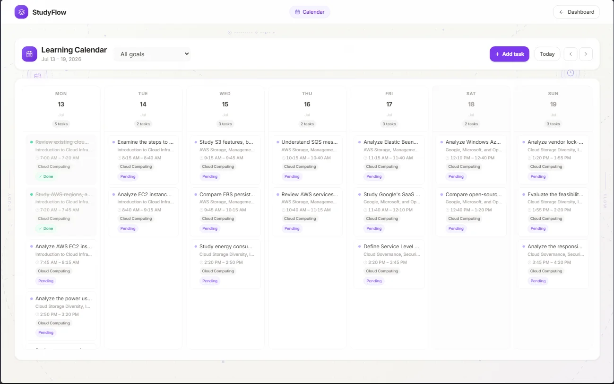

<div align="center">
  

  # StudyFlow

  **Turn PDF study materials into an editable learning flow.**

  [](https://production.d3aqtwtunlj452.amplifyapp.com/)

  
  
  
  
  
</div>

<p align="center">
  
</p>

## About

StudyFlow is an AI-assisted personal learning application that transforms PDF materials into editable learning plans. Users can schedule tasks around their available time, study with a customizable Pomodoro workspace, complete AI-generated quizzes, and monitor their progress in one place.

<p align="center"><strong>Plan → Schedule → Focus → Quiz → Track</strong></p>

## Key Features

- AI-powered PDF analysis with Google Gemini.
- Editable learning plan before schedule generation.
- Weekly Calendar with goal filtering and drag-and-drop.
- Customizable focus and short-break sessions.
- AI-generated quizzes with answer review.
- Dashboard with progress, focus history, and study streak.

## Product Preview

<table>
  <tr>
    <td width="50%">
      
    </td>
    <td width="50%">
      
    </td>
  </tr>
  <tr>
    <td align="center"><strong>Editable AI Plan Preview</strong></td>
    <td align="center"><strong>Weekly Learning Calendar</strong></td>
  </tr>
</table>

## Tech Stack

| Layer | Technologies |
|---|---|
| Frontend | React, Vite, Tailwind CSS |
| Backend | Java 21, Spring Boot, Spring Security |
| Database | PostgreSQL, JSONB, UUID |
| AI | Google Gemini API |
| Deployment | AWS Amplify Hosting, EC2, RDS, Nginx |

## Run Locally

### Requirements

- Java 21
- Node.js and npm
- Docker Desktop

### 1. Clone and configure

```powershell
git clone https://github.com/LeThanhChinhh/study-flow.git
cd study-flow
Copy-Item .env.example .env
```

### 2. Start PostgreSQL and initialize the schema

```powershell
docker compose up -d --wait

Get-Content database/schema.sql | docker exec -i studyflow-postgres psql -U studyflow_user -d studyflow_db
```

Run the schema command only when initializing a new database volume.

### 3. Start the backend

```powershell
cd backend-core
.\mvnw.cmd spring-boot:run
```

### 4. Start the frontend

Open another terminal:

```powershell
cd frontend
npm install
npm run dev
```

Then open `http://localhost:5173`.

> Local planning uses the mock provider by default. Configure `GEMINI_API_KEY` and the related variables from `.env.example` in the backend environment to use Gemini.

## Deployment

The frontend is deployed with **AWS Amplify Hosting**. The Spring Boot backend runs on **Amazon EC2** behind **Nginx**, while production data is stored in a private **Amazon RDS PostgreSQL** instance.

[Open the production application](https://production.d3aqtwtunlj452.amplifyapp.com/)

## Team

| Member | Student ID |
|---|---:|
| Lê Thành Chính | 052205009303 |
| Trần Ngọc Nhân | 052205000516 |
| Nguyễn Hoàng Đức Oai | 067205000764 |

---

<div align="center">
  Academic MVP developed for the Software Engineering Practical Project course.
</div>
